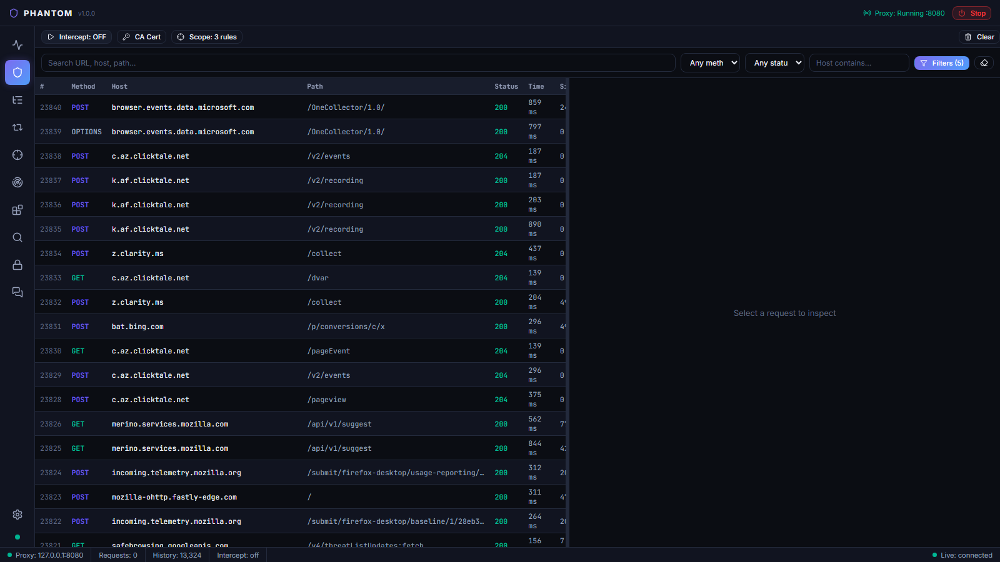
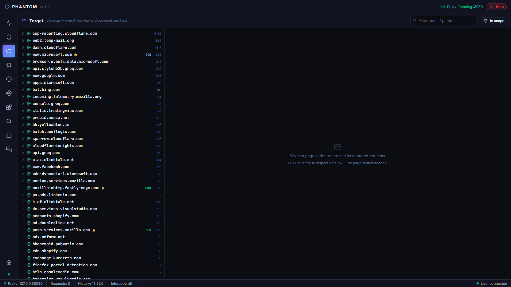
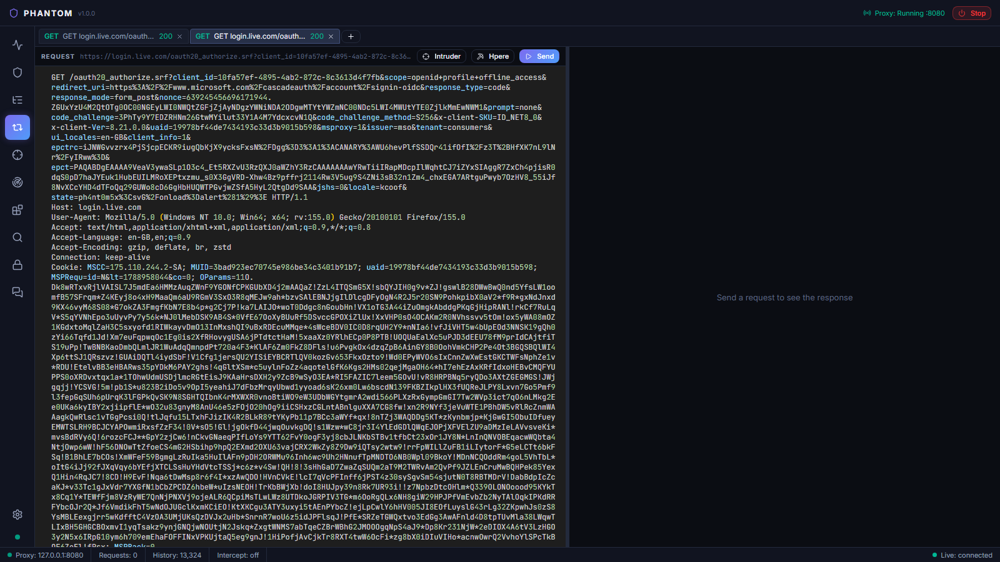
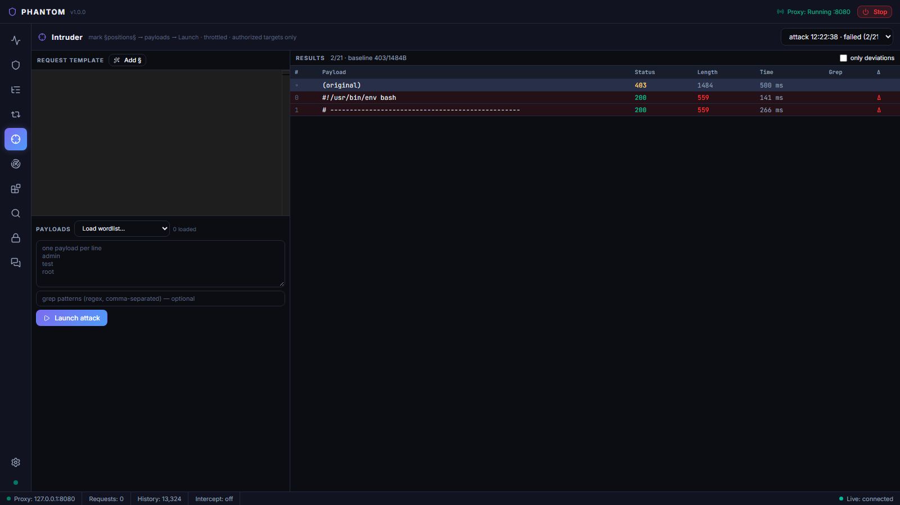
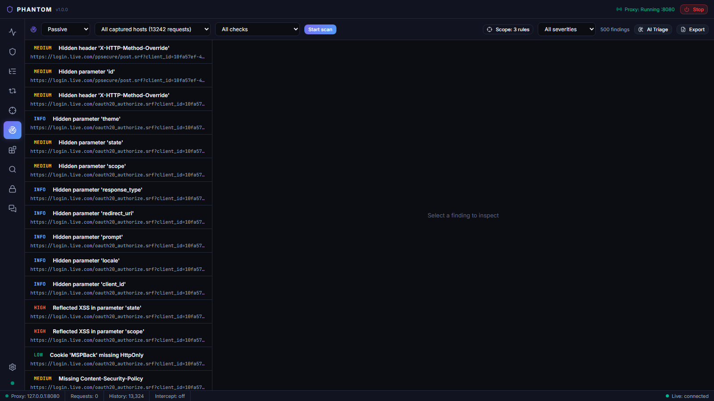
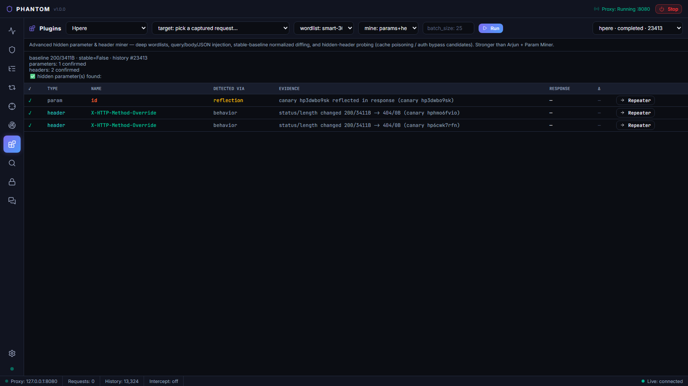
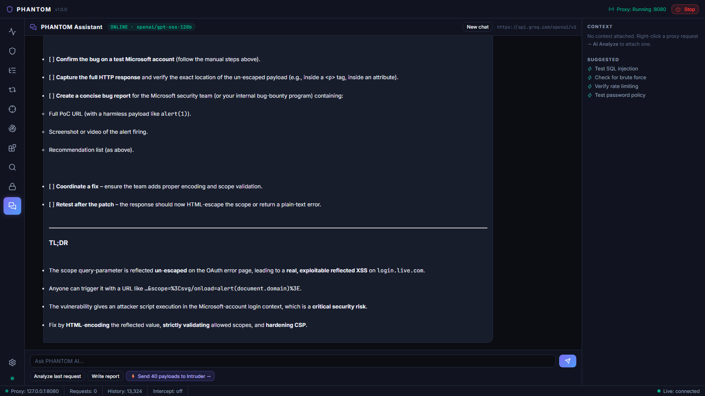
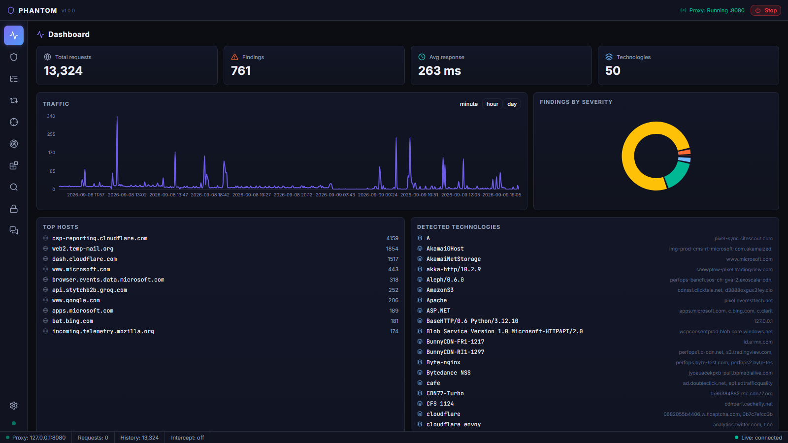

# PHANTOM

**A web application security testing platform that runs entirely on your machine.**

PHANTOM sits between your browser and the applications you test. It captures every request and response, lets you inspect and replay them, hunts for hidden parameters and misconfigurations, runs a vulnerability scanner, and writes up the findings — all in one workspace, with no traffic ever leaving your computer except the requests you deliberately send.

It is built for people who do manual testing and want power tools around them, not a black box that does everything for you.

---

## Screenshots

| Proxy — live traffic, filters, intercept | Target — site map tree |
|---|---|
|  |  |

| Repeater — edit & replay with response search | Intruder — payload attacks |
|---|---|
|  |  |

| Scanner — findings with triage & reports | Plugins — Hpere and friends |
|---|---|
|  |  |

| Assistant — context-aware help | Dashboard |
|---|---|
|  |  |

All screenshots are real captures from the running application ([docs/screenshots/](docs/screenshots/)).

---

## What's inside

| Module | What it does |
|---|---|
| **Proxy** | Intercepting HTTP(S) proxy with live history, display filters, request interception, match & replace, and a context menu that sends traffic anywhere else in the app |
| **Target** | A site map of everything you've captured, grouped by host and path, with request detail inline |
| **Repeater** | Edit and replay captured requests in a full code editor, with search inside responses and one-click render in a real browser |
| **Intruder** | Fuzz any part of a request with payload lists; results in a sortable table with payload/length/status columns |
| **Scanner** | 12 passive and active checks (XSS, SQLi, SSRF, open redirect, CORS, security headers, cookies, CSRF, JWT, secrets, hidden params…), deduplicated, throttled, scope-gated |
| **Plugins** | Focused hunting tools — see below |
| **Search** | Full-text search across every request, response, and finding you've captured |
| **Decoder** | Encode, decode, and hash transforms: Base64, URL, HTML, hex, unicode, gzip, JWT, MD5/SHA — chainable, with auto-detect |
| **Assistant** | A chat panel that can read the request or finding you're looking at, explain what it means, suggest next steps, and send generated payloads straight to Intruder |
| **Dashboard** | Traffic over time, findings by severity, top hosts, detected technologies — every stat is a shortcut into the module behind it |
| **Settings** | Scope rules, match & replace rules, scanner throttling, AI provider — no config files to edit |

### The plugins

| Plugin | What it hunts |
|---|---|
| **Hpere** | Hidden parameters and headers. Batched canary probing with bisection and double confirmation — designed to find what the well-known param miners miss, in query strings, form bodies, and JSON bodies |
| **CORS Hunter** | Dangerous CORS policies: reflected arbitrary origins, subdomain/prefix/suffix spoofing, null origin, HTTP downgrade |
| **Method Probe** | Risky HTTP methods: TRACE (XST), PUT/DELETE/PATCH on read-only endpoints, DEBUG, advertised-but-unsupported methods |
| **Path Probe** | Sensitive paths that shouldn't be public: `.git/`, `.env`, backups, actuator endpoints, swagger, server-status, and about 30 more |

Everything is connected: right-click a request in the Proxy to send it to the Repeater, Intruder, Scanner, or any plugin. Findings link back to the request, forward to the Assistant for analysis, and into reports for export.

---

## The workflow at a glance

```
                 ┌──────────────────────────────────────────────────┐
                 │                 1. SET SCOPE                     │
                 │        Settings → Scope: *.example.com           │
                 └───────────────────────┬──────────────────────────┘
                                         │
   Browser ──► ┌────────────────────────▼─────────────────────────┐
   (proxy :8080)│  2. PROXY — browse the target, capture traffic   │
               └───────┬──────────────────┬───────────────┬───────┘
                       │                  │               │
              ┌────────▼───────┐  ┌───────▼──────┐  ┌─────▼─────────┐
              │ 3. TARGET      │  │ 4. REPEATER  │  │ 5. INTRUDER   │
              │ site map, pick │  │ edit & retry │  │ fuzz payloads │
              │ what matters   │  │ one request  │  │ at scale      │
              └────────┬───────┘  └───────┬──────┘  └─────┬─────────┘
                       │                  │               │
                       └────────┬─────────┴───────────────┘
                                ▼
                 ┌──────────────────────────────────────────────────┐
                 │  6. SCANNER + PLUGINS — automated hunting        │
                 │     (in-scope only, throttled, deduplicated)     │
                 └───────────────────────┬──────────────────────────┘
                                         ▼
                 ┌──────────────────────────────────────────────────┐
                 │  7. TRIAGE — review findings, ask the Assistant, │
                 │     export the report                            │
                 └──────────────────────────────────────────────────┘
```

A module-by-module walkthrough with every button explained lives in **[docs/USAGE.md](docs/USAGE.md)**.

---

## Getting started

PHANTOM runs from source: a Python backend, a web frontend, and an optional Electron shell. Setup takes about five minutes.

**Prerequisites**

- Python 3.11 or newer
- Node.js 18 or newer
- Git

### Windows

Open **PowerShell** or **Git Bash**:

```powershell
git clone https://github.com/Kcoof/PHANTOM.git
cd PHANTOM

# 1. Backend
cd backend
python -m venv .venv
.venv\Scripts\activate          # PowerShell/cmd  (Git Bash: source .venv/Scripts/activate)
pip install -r requirements.txt
uvicorn main:app --host 127.0.0.1 --port 8899 --reload

# 2. Frontend (new terminal, from the PHANTOM folder)
cd frontend
npm install
npm run dev                     # opens http://localhost:5173
```

Or run both at once with `powershell -File scripts/dev.ps1`.

### Linux

```bash
git clone https://github.com/Kcoof/PHANTOM.git
cd PHANTOM

# 1. Backend (on Debian/Ubuntu install python3-venv first if needed)
cd backend
python3 -m venv .venv
source .venv/bin/activate
pip install -r requirements.txt
uvicorn main:app --host 127.0.0.1 --port 8899 --reload

# 2. Frontend (new terminal, from the PHANTOM folder)
cd frontend
npm install
npm run dev                     # opens http://localhost:5173
```

Or run both at once with `bash scripts/dev.sh`.

The same steps work on macOS (`python3` / `source .venv/bin/activate`).

### Desktop app (optional)

The Electron shell wraps the UI in a standalone window:

```bash
cd frontend
npm run electron:dev      # dev mode
npm run electron:build    # packaged build for your OS
```

---

## First run — three steps

**1. Start the proxy.** In the app, open **Proxy** and press **Start**. It listens on `127.0.0.1:8080`. Point your browser at it (`http://127.0.0.1:8080`).

**2. Trust the CA (for HTTPS).** Download the certificate from the Proxy view or <http://127.0.0.1:8899/api/proxy/ca-cert>, then import it into your browser's or OS trust store:

- *Firefox:* Settings → Privacy & Security → Certificates → View Certificates → Authorities → Import → check "Trust for websites"
- *Chrome/Edge/Windows:* double-click the `.pem` → Install Certificate → Local Machine → "Place all certificates in the following store" → Trusted Root Certification Authorities
- *Linux (system-wide):* `sudo cp phantom-ca.pem /usr/local/share/ca-certificates/phantom-ca.crt && sudo update-ca-certificates`

A quick smoke test from the terminal:

```bash
curl -x http://127.0.0.1:8080 http://example.com
# HTTPS against the PHANTOM CA:
curl -x http://127.0.0.1:8080 --cacert phantom-ca.pem https://example.com
# Windows curl (schannel) may also need: --ssl-no-revoke
```

**3. Set your scope.** In **Settings → Scope**, add an include rule for what you're allowed to test (e.g. `*.example.com` — a bare domain automatically covers its subdomains). Active scanning and the plugins refuse to run outside it. This is deliberate.

---

## Authorized testing only

PHANTOM is a tool for people testing systems they own or have written permission to test — your own lab, DVWA, OWASP Juice Shop, or a program with a signed scope. Active scanning is scope-gated by design and will not fire until you define an include rule. Respect the rules of engagement of any program you test; the tool makes that easy, not hard.

All captured data stays on your machine in a local SQLite database. There is no telemetry and no cloud dependency.

## The Assistant (optional)

The Assistant panel talks to any OpenAI-compatible endpoint. Two easy options:

- **A cloud key** — e.g. [Groq](https://console.groq.com) (free tier available): Settings → AI → provider "OpenAI-compatible", base URL `https://api.groq.com/v1`, paste your key, pick a model.
- **A local model** — [Ollama](https://ollama.com): `ollama serve` then `ollama pull llama3.1` (or any model), and point the settings at it.

Nothing in PHANTOM depends on the Assistant. If it's not configured, every other module works exactly the same — and request data is only sent to the provider when *you* ask for an analysis.

## Tests

```bash
cd backend
# Windows:  .venv\Scripts\python -m pytest tests/ -v
# Linux:    .venv/bin/python -m pytest tests/ -v
```

41 tests cover the API surface, scope matching, scanner checks, and all four plugins (each plugin is tested against a local fake target that exhibits exactly the bug it hunts).

## Built the spec-driven way

This repo was built with [GitHub Spec Kit](https://github.com/github/spec-kit): the engineering constitution, feature specs, technical plans, and task checklists for every milestone live in [`specs/`](specs/), and the working agreements in [`.specify/memory/constitution.md`](.specify/memory/constitution.md). If you want to understand *why* the tool is shaped the way it is, start there.

## Architecture

```
Electron shell ── React/TS UI (Vite; Zustand, Monaco, Recharts)
      │                │  REST /api/*   +   WebSocket /ws (live events)
      │                ▼
      └────▶ FastAPI backend (127.0.0.1:8899)
                ├─ Proxy engine   in-process mitmproxy (127.0.0.1:8080)
                ├─ Scanner engine 12 passive/active checks, throttled, deduplicated
                ├─ Plugin engine  Hpere · CORS Hunter · Method Probe · Path Probe
                ├─ Intruder       batched, concurrent attack runner
                └─ SQLite (aiosqlite, WAL) — all data local
```

## License

MIT — see [LICENSE](LICENSE).
